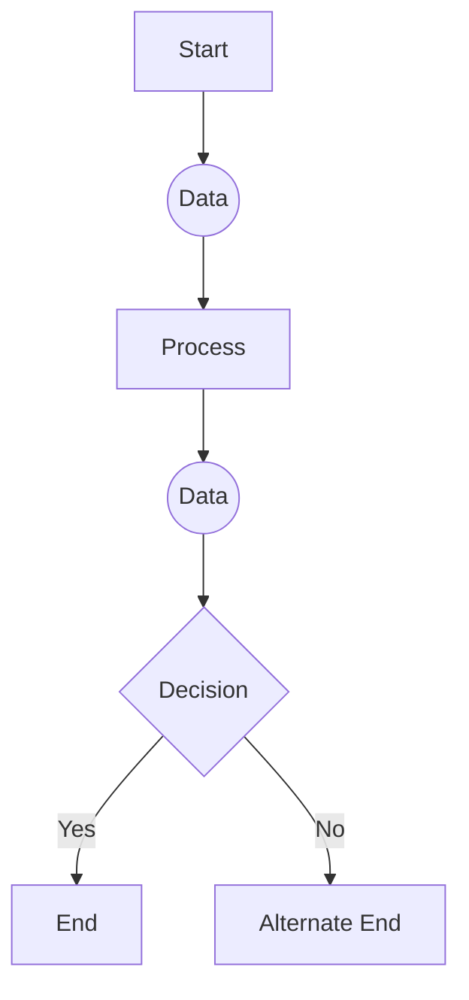

# c4 diagrams

Org wide archietecture
* https://structurizr.com/dsl
  
# mermaid

Embeddable in a repo

dataflow 

```mermaid
graph TD
    A[Start] --> F((Data)) --> B[Process] --> G((Data))
    G --> C{Decision}
    C -->|Yes| D[End]
    C -->|No| E[Alternate End]
```
