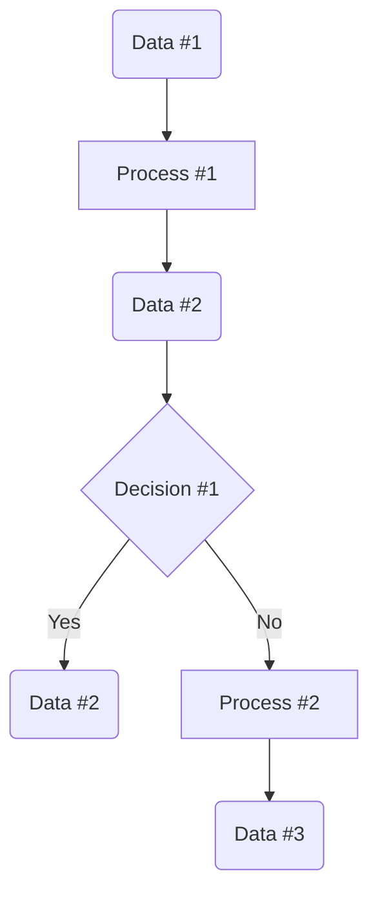
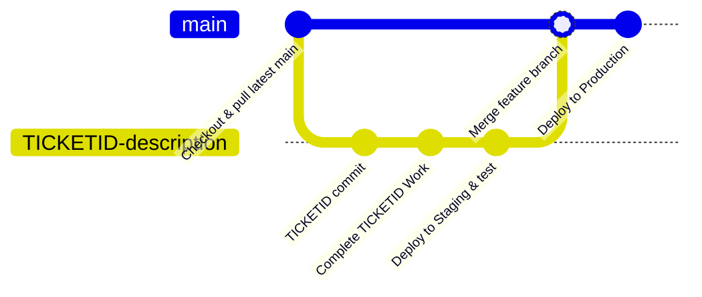
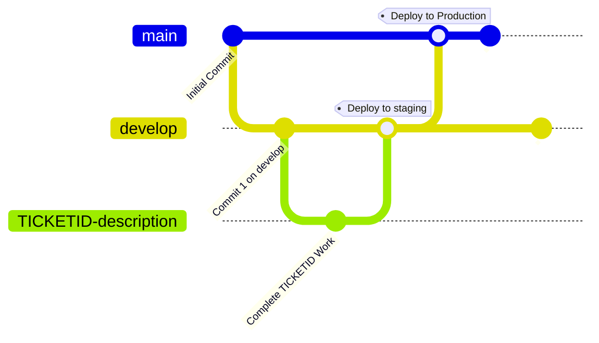

# Software Development

How to write code.

## Project Lifecycle

### Requirements Gathering

#### User Story

Ask those who the project impacts, stakeholders and endusers.

* What is your goal?
   * Current workflow - limitations? why?
   * Desired workflow - ideal new process?
* What do you think would make this project a success?
* What are your concerns?

The outcome should be a [specification document](project_spec_doc.md). 

#### Design
* Dataflow Diagrams (Miro, Draw.io, Excalidraw) - How does data move through the system? Human touch points?
  * Data (circle)
  * Process [square]
  * Decision \<diamond\>
  * Arrows -->

*
* [Test Specification](test_spec_doc.md)
* [ADRs](adr.md)
* Tickets

#### Implementation
(see Agile Management & Kaban Planning)

#### Review
Have the success goals in the [specification document](project_spec_doc.md) been met? Demo to stakeholders.

## Agile Management & Kanban Planning

### Tickets & Columns

Tickets should be tagged/filterable by project and assinged a size based on estimated effort.

Tickets preferably have a specific problem or feature statement as the name, avoid implementation detail here.

* Triage - New requests and bugs are entered here for review at backlog, assign to someone to write out the ticket.
```
**As a ... 
**I would like** ...
**Such that** ...

**options** ... various solutions
**techinal details** ... link to docs, relevant considerations
**acceptance criteria** ... when is this ticket done?
**questions** ... uncertainty remaining and who to ask
```
* Sprint Backlog - Spec'd tickets for next sprint (If this column grows unmanagable then split into: Next Spint, This Quater, Quater Backlog)
* Sprint - work for this sprint
* In-progress - work underway
* Review - Assign reivewer to PR (If this column grows unmanagable then split into: Ready for Review, In Review )
* Complete - done!

#### Updating Tickets

At the end of your workday update the ticket with a comment indicating progress, tagging those whose input is required eg for review. In doing so you have:
* Transparency on work
* Colleagues are notified and can asynchronously action your needs
* Standup is quicker being simply a nod to each ticket's comment

### Meetings
	
* Standup DAILY
   * Right to left across the board with progress update per ticket OR individual _stands up_ and says "yesterday I ... today I'll ... my blockers are ..."
   * Raise blockers
   * Assign reviewers to live PRs
* Backlog refinement WEEKLY 
   * Review tickets in Triage
   * Do / dont do
   * Detail & move into Sprint Backlog
* Sprint plannning BIWEEKLY
   * Move tickets from Spring Backlog into Sprint
* Retro BIWEEKLY
   * Review sprint 
   * Good
   * Bad
   * Actions - formalise the good, mitigate the bad. Add triage tickets for actions. 
* Demo MONTHLY
   * Show stakeholders the live work


### Software Management

#### Version Control

##### Github Flow

Github flow is prefered, as it avoids the long lived development branch & encourages continous small releases



##### Git Flow



#### Code Review
* [Author's Pull-Request description](https://google.github.io/eng-practices/review/developer/cl-descriptions.html) - sufficent to understand changes what/why?
* Pair programming - pair review with the author is the quickest way to gain insight into the changes at the expense of asynchronicity.
* [Design, Functionality, Complexity, Tests, Naming, Comments, Style, Docs](https://google.github.io/eng-practices/review/)
* [Conventional Comments](https://conventionalcomments.org/) 

#### Environments
* Development
* Staging
* Production

#### Devops / CICD
* Tests
* Deployment
