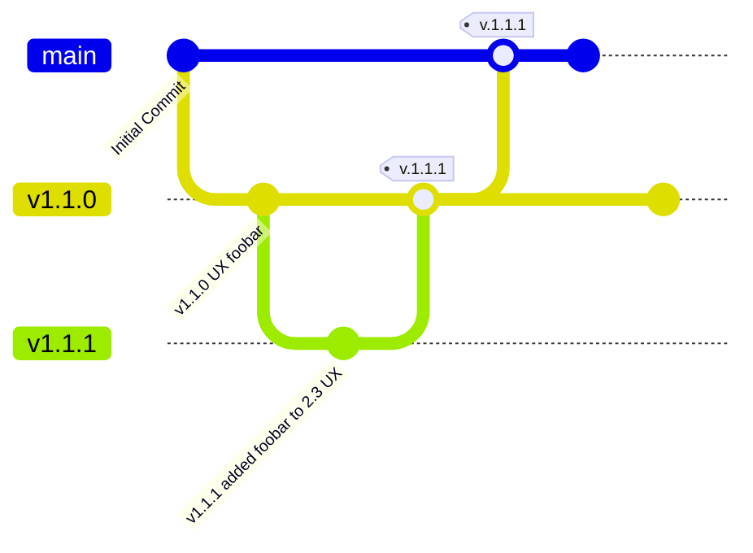

# Feature Requirements

**v1.0.0**

1.  [Introduction](#1-introduction)
    1.  [Repository and Documentation](#11-repository-and-documentation)
    1.  [Team](#12-team)
    1.  [Definitions](#13-definitions)
    2.  [The Need](#14-the-need)
    3.  [Assumptions and Dependencies](#15-assumptions-and-dependencies)
    4.  [Constraints](#16-constraints)
2.  [Questions](#2-questions)
3.  [Specification](#3-specification)
    1.  [Features](#31-features)
    2.  [External Interfaces](#32-external-interfaces)
    3.  [UX](#33-ux)
    4.  [CICD](#34-cicd)
    5.  [Non-Functional Requirements](#35-non-functional-Requirements)
    6.  [Dataflow](#36-dataflow)
4. [README](#readme)


## 1. Introduction

_What problem are you trying to solve? In brief, what is being built and why?_

### 1.1 Repository and Documentation

*   **Repository:** [GitHub Repo Link](https://github.com/your-repo)
*   **Project Spec** [Project Spec Doc](https://github.com/your-repo/project-spec_doc.md)

### 1.2 Team

*List each team members role to be performed during the development.*

| Name     | Role                   |
|-----------------|:----------------------:|
|                |                        |
|                 |                        |
|             	 |                        |

### 1.3 Definitions

_Define terms, acronyms, and abbreviations._

### 1.4 The Need

  |Problem  |Need | Source
  |---  |---  |---  |
  |_Present constraint_|_This would be alleviated by_|_Link to userstory/bug/discussion_|

### 1.5 Assumptions and Dependencies

_Prerequisites, assumptions or dependencies of the feature._

### 1.6 Constraints

_What does this feature not cover?_

## 2. Questions

  |Question  |Research Plan | Resolution Date | Answer
  |---  |---  |---  |---  
|_What the..?_  |_What if..?_| _date_|_Ah!_


## 3. Specification

### 3.1 Features

_PROJ.1.1.1 The foo will bar_

### 3.2 External Interfaces

_Define the data required from and to present to external entities. A table for inputs/outputs._
Variable  | Description | Datatype | Source/Destination  | Access
  |---  |---  |---  |--- |---
  |_Name_|_What is being sent/fetched_|_link to object definition_|_Database? Endpoint? Cloudstore?_|_Auth / Connection String / Permissions_|

### 3.3 UX

_Describe the user interface requirements. Link to figma / design._

### 3.4 CICD

_Overview tests refering to the feature ID PROJ.1.1.1 and deployment environment and process_


### 3.5 Non-Functional Requirements

_PROJ.1.1.1 Detail the non-functional requirements such as performance, security, and usability._

## 3.6 Dataflow


_Include diagrams to illustrate the system architecture, data flow, and other relevant aspects._

_Use a diagram library like Mermaid to create and include diagrams._

```mermaid
graph TD     A[Start] --> B[Process]     B --> C[Decision]     C -->|Yes| D[End]     C -->|No| E[Alternate End]
```

## 4. README

Contribute to this document much as you would a software project. Don't be afraid of verbose commits detailing your change. Ensure to update the document version at the top.



