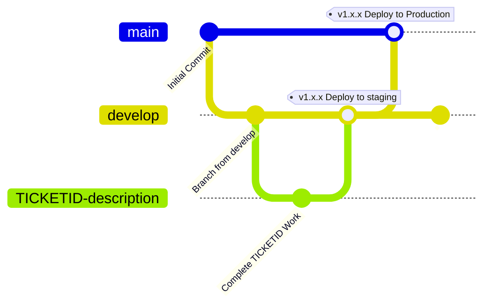

# Git
Version Control Tool
4
## Tags
Git, Devops

## Gitflow



## I want to...

### _...be up-to date with remote_
```
$ git fetch
$ git pull origin <branchname> 
```
###  _...commit some code changes._
```
$ git add --patch
```
y - stage this hunk  
n - don't stage this hunk  
s - this hunk contains bits relating to multiple changes, split for more focused commits
```
$ git commit -m '<TICKETID> - what these changes do'
```
### _...push my changes to remote_
```
$ git push origin <branchname>

### _...undo that last commit (unstage committed changes)_

```
$ git reset HEAD~1
``` 

```
$ git restore --staged <path/to/unstage>
``` 

```
###  _...swap branch_
#### _...pull from remote with local changes_ 
#### _...handle "error: Your local changes to the following files would be overwritten"_
```
$ git stash push -m 'these changes do some stuff'
$ git checkout <branchname> $ git pull origin <branchname> 
$ git stash pop 
```

OR just commit the changes with -m "stash" then follow _...undo that last commit_ when you want them back

### _...I've branched from feature branch which has then been merged_  
#### _...I wish to resurrect a branch that I've already merged_  
#### _..."Theres stuff in my branch thats already in main?"_
#### _..."Theres commits in my PR that have already been merged?"_

Ensure your main is up to date (else you'll rebase onto an old main), this only works if main can be fastforwarded so check the output.  
```
$ git fetch origin main:main  
```
If you simply rebase you have to go through the merge hell of commits that you then changed later in the history!  
```
$ git rebase -i main
```
  
**vim**

Use dd to remove commits you don't require (such as already included commits already in main)

_I messed up_ normal mode **:cq** to "cancel quit"

_ready to rebase_ normal mode **:wq** to "write quit"

**/vim**

Conflicts? Resolve them and add the offending file

  
```
$ git add offending\_file.py
$ git rebase --continue
```
