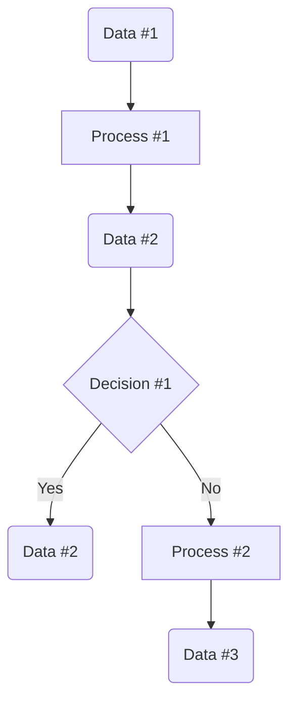
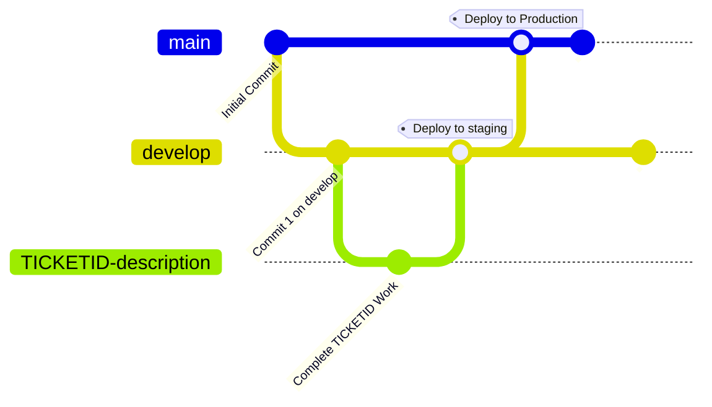

# Software Development

How to write code.

## Project Lifecycle

### Requirements Gathering

#### User Story

Ask those who the project impacts, stakeholders and endusers.

* What is your goal?
   * Current workflow - limitations? why?
   * Desired workflow - ideal new process?
* What do you think would make this project a success?
* What are your concerns?

The outcome should be a [specification document](spec_doc.md). 

#### Design
* Dataflow Diagrams (Miro, Draw.io, Excalidraw) - How does data move through the system? Human touch points?
  * Data (circle)
  * Process [square]
  * Decision \<diamond\>
  * Arrows -->

* [ADR](adr.md)
* Tickets

#### Implementation
(see Agile Management & Kaban Planning)

#### Review


## Agile Management & Kanban Planning

### Tickets & Columns

Tickets should be tagged/filterable by project and assinged a size based on estimated effort

* Triage - New requests and bugs are entered into for review at backlog
```
**As a ... 
**I would like** ...
**Such that** ...
```
* Spec - Tickets that require a specification
```
**options** ... various solutions
**techinal details** ... link to docs, relevant considerations
**acceptance criteria** ... when is this ticket done?
**questions** ... uncertainty remaining and who to ask
```
* Sprint Backlog - Spec'd tickets for next sprint
* Sprint - work for this sprint
* In-progress - work underway
* Review - Assign reivewer to PR 
* Complete - done!


### Meetings
	
* Standup DAILY
   * Right to left across the board with progress update per ticket
   * Raise blockers
   * Assign reviewers to live PRs
* Backlog refinement WEEKLY 
   * Review tickets in Triage
   * Do / dont do
   * Detail & move into Spec
* Sprint plannning BIWEEKLY
   * Move tickets from Spring Backlog into Sprint
* Retro BIWEEKLY
   * Review sprint 
   * Good
   * Bad
   * Actions - formalise the good, mitigate the bad. Add triage tickets for actions. 
* Demo BIWEEKLY
   * Show stakeholders the live work


### Software Management

#### Version Control



#### Environments
* Staging
* Production

#### Devops / CICD
* Tests
* Deployment
